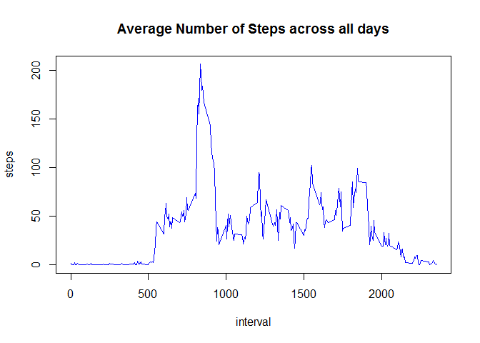
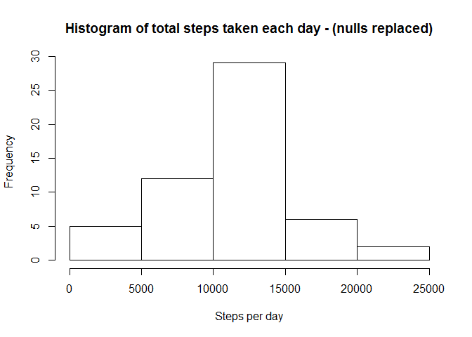

---
title: "Reproducible Research: Peer Assessment 1 "
output: html_document:keep_md: true
----


## Loading and preprocessing the data.


```r
library(plyr)
library(lattice)
setwd("F:/coursera/repos/RepData_PeerAssessment1/")
padata<-read.csv("activity.csv")
```


## What is mean total number of steps taken per day?


```r
###Total number of steps per day
stepsPerDay<-aggregate(steps~date,na.omit(padata),sum)
head(stepsPerDay)
```

```
##         date steps
## 1 2012-10-02   126
## 2 2012-10-03 11352
## 3 2012-10-04 12116
## 4 2012-10-05 13294
## 5 2012-10-06 15420
## 6 2012-10-07 11015
```

<!-- -->

###Calculate and report the mean and median of the total number of steps taken per day


```r
#mean

stepsPerDayMean <- mean(stepsPerDay$steps)
head(stepsPerDayMean)
```

```
## [1] 10766.19
```

```r
#median

stepsPerDayMedian <- median(stepsPerDay$steps)
head(stepsPerDayMedian)
```

```
## [1] 10765
```

## What is the average daily activity pattern?

###Plot interval vs Average steps
<!-- -->

###Determine maximum 5 minute interval across all days

```r
intervalStepsMean[which.max(intervalStepsMean$steps),1]
```

```
## [1] 835
```

## Inputing missing values


```r
###Total number of missing values in the dataset
sum(is.na(padata))
```

```
## [1] 2304
```

```r
###New dataset with missing values filled in.
padata1<-padata
padata1$steps[is.na(padata1$steps)] <- intervalStepsMean$steps[is.na(padata1$steps)]
head(padata1)
```

```
##       steps       date interval
## 1 1.7169811 2012-10-01        0
## 2 0.3396226 2012-10-01        5
## 3 0.1320755 2012-10-01       10
## 4 0.1509434 2012-10-01       15
## 5 0.0754717 2012-10-01       20
## 6 2.0943396 2012-10-01       25
```

```r
###Calculate the total number of steps taken per day
stepsPerDay1<-aggregate(steps~date,data=padata1,sum)
head(stepsPerDay1)
```

```
##         date    steps
## 1 2012-10-01 10766.19
## 2 2012-10-02   126.00
## 3 2012-10-03 11352.00
## 4 2012-10-04 12116.00
## 5 2012-10-05 13294.00
## 6 2012-10-06 15420.00
```

<!-- -->


```r
###Calculate and report the mean and median of the total number of steps taken per day

####mean
stepsPerDayMean1 <- mean(stepsPerDay1$steps)
stepsPerDayMean1
```

```
## [1] 10766.19
```

```r
####median
stepsPerDayMedian1 <- median(stepsPerDay1$steps)
stepsPerDayMean1
```

```
## [1] 10766.19
```

```r
## Differences between estimates of filled na with na values

###Difference in Steps per Day Mean
stepsPerDayMean1 - stepsPerDayMean
```

```
## [1] 0
```

```r
###Difference in Steps per Day Median
stepsPerDayMedian1 - stepsPerDayMedian
```

```
## [1] 0.5943396
```
##Are there differences in activity patterns between weekdays and weekends?
###Create a new factor variable withlevels - "weekday" and "weekend" 

```r
padata1$day<-as.factor(weekdays(as.Date(padata1$date)))
padata1 <- within(padata1, levels(day)[grep("S+",levels(padata1$day))] <- "Weekend")
padata1 <- within(padata1, levels(day)[levels(padata1$day) != "Weekend"] <- "Weekday")
padata1$date<-NULL
```
###Plot time series data - interval vs steps by Weekend, Weekday
<!-- -->

